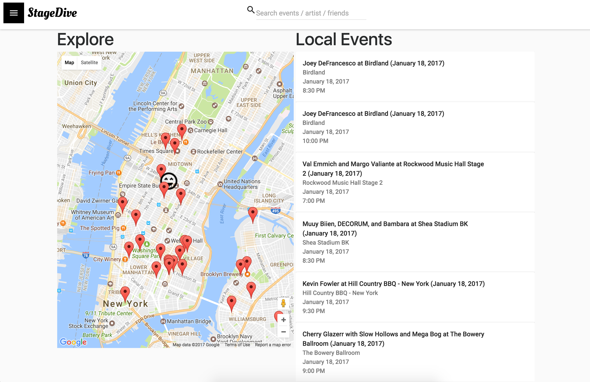

# StageDive

Stage Dive is a social media web app for music enthusiasts who want to centralize their upcoming concerts, connect with friends, and explore events from favorite artists.

The app makes it easy to search for events, follow artists, and add friends. The home page presents an organized and easy to read layout that immediately shows important details about events you have been tracking.  

Stage Dive automatically keeps track and saves photos of events you’ve attended in your concert journal. Within each journal entry, you can comment and share your experiences with your friends.

If you don’t have any plans for the weekend and you’d like to see what's happening around you, head over to the explore page to discover local events near you.

Stage Dive was built by three full stack software engineers: Timothy Yin, Sean Ho, and Adam Wang.

Stage Dive uses a relational MySQL database, and is powered by React with Redux on the front end, and Node/Express on the backend. The Google Maps API was used to provide map views.

StageDive aggregates data from several entertainment API’s including Ticketmaster, Songkick, and Bandsintown.

Thanks for visiting out page! If you have any feedback or suggestions, please email tyin92@gmail.com.
